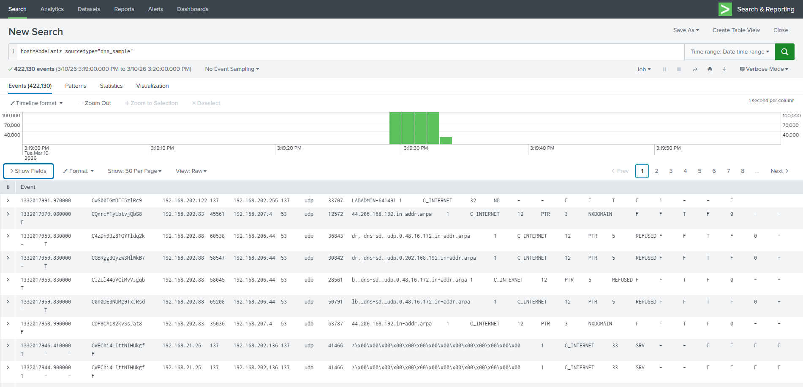
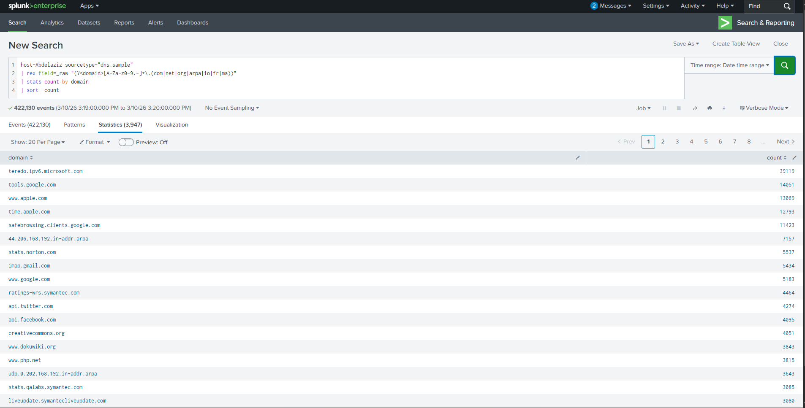
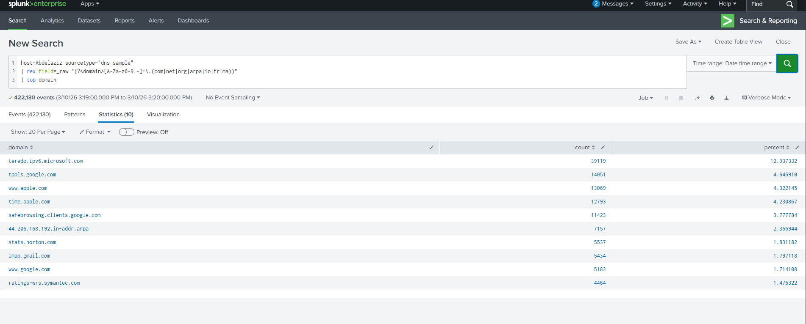
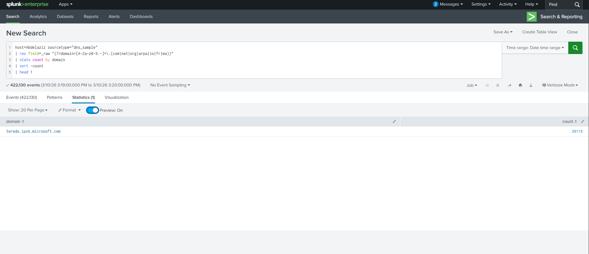

#  DNS Log Analysis Using Splunk SIEM


##  Overview

This project demonstrates how to upload, parse, and analyze **DNS (Domain Name System) log files** using **Splunk Enterprise SIEM**. DNS logs are a critical data source in cybersecurity, providing visibility into network activity and helping detect threats such as:

- DNS tunneling
- Command & Control (C2) communication
- Data exfiltration
- Malicious domain lookups

---

##  Screenshots

| Step | Description |
|------|-------------|
|  | Raw DNS events view (422,130 events) |
|  | Domain frequency statistics |
|  | Top 10 most queried domains |
|  | Most queried domain identified |

---

##  Dataset

| File | Format | Size | Events |
|------|--------|------|--------|
| `dns_2_log.gz` | Gzip compressed log | — | 422,130 |

- **File:** `dns_2_log.gz` — real DNS traffic log used in this analysis
- **Sourcetype:** `dns_sample`
- **Time Range:** 3/10/26 3:19:00 PM → 3:20:00 PM
- **Loaded into Splunk via:** Settings → Add Data → Upload

---
##  Prerequisites

- Splunk Enterprise (installed and running)
- DNS log sample file (`dns_sample` sourcetype)
- Basic knowledge of SPL (Splunk Processing Language)

---

##  Setup

### 1. Upload DNS Log File to Splunk

1. Log in to Splunk Web Interface
2. Go to **Settings → Add Data → Upload**
3. Select your DNS log file
4. Set **Source Type** to `dns_sample`
5. Configure index, host, and sourcetype
6. Click **Submit**

### 2. Verify the Upload

```spl
index=* sourcetype="dns_sample"
```

---

##  SPL Queries Used

### Basic Event Search
```spl
host=Abdelaziz sourcetype="dns_sample"
```
> Returns all 422,130 DNS events from the configured host.

---

### Extract Domain Names & Count by Domain
```spl
host=Abdelaziz sourcetype="dns_sample"
| rex field=_raw "(?<domain>[A-Za-z0-9.-]+\.(com|net|org|arpa|io|fr|ma))"
| stats count by domain
| sort -count
```
> Uses regex extraction to parse domain names from raw log data, then ranks them by frequency.

---

### Top 10 Most Queried Domains
```spl
host=Abdelaziz sourcetype="dns_sample"
| rex field=_raw "(?<domain>[A-Za-z0-9.-]+\.(com|net|org|arpa|io|fr|ma))"
| top domain
```
> Returns the top 10 domains with count and percentage.

---

### Most Queried Domain (Single Result)
```spl
host=Abdelaziz sourcetype="dns_sample"
| rex field=_raw "(?<domain>[A-Za-z0-9.-]+\.(com|net|org|arpa|io|fr|ma))"
| stats count by domain
| sort -count
| head 1
```
> Identifies the single most queried domain — `teredo.ipv6.microsoft.com` with **39,119 queries**.

---

## 📊 Key Findings

| Rank | Domain | Count | % of Total |
|------|--------|-------|------------|
| 1 | `teredo.ipv6.microsoft.com` | 39,119 | 12.94% |
| 2 | `tools.google.com` | 14,051 | 4.65% |
| 3 | `www.apple.com` | 13,069 | 4.32% |
| 4 | `time.apple.com` | 12,793 | 4.23% |
| 5 | `safebrowsing.clients.google.com` | 11,423 | 3.78% |
| 6 | `44.206.168.192.in-addr.arpa` | 7,157 | 2.37% |
| 7 | `stats.norton.com` | 5,537 | 1.83% |
| 8 | `imap.gmail.com` | 5,434 | 1.80% |
| 9 | `www.google.com` | 5,183 | 1.71% |
| 10 | `ratings-wrs.symantec.com` | 4,464 | 1.48% |

> **Total Events Analyzed:** 422,130 | **Unique Domains Found:** 3,947

---

##  Analysis Insights

- **`teredo.ipv6.microsoft.com`** dominates the traffic — this is Windows' IPv6 tunneling mechanism, normal in Windows environments but worth monitoring for volume anomalies.
- High queries to **Norton** and **Symantec** domains suggest endpoint security software is active on the network.
- **Reverse DNS lookups** (`in-addr.arpa`) appear frequently, which is typical behavior for internal network resolution.
- Traffic to **Google**, **Apple**, and **Microsoft** domains is expected in a corporate environment.

---


##  References

- [Splunk Documentation](https://docs.splunk.com)
- [DNS Security Best Practices](https://www.cisa.gov/dns-security)
- [MITRE ATT&CK - DNS](https://attack.mitre.org/techniques/T1071/004/)

---

##  Author

**Abdelaziz**  
Cybersecurity Analyst | Splunk SIEM  

---

##  License

This project is for educational purposes. Feel free to use and adapt.
